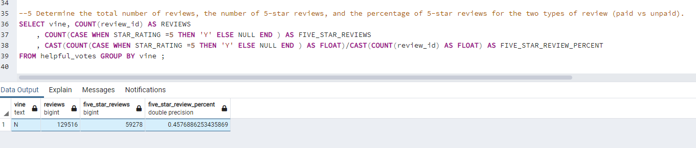
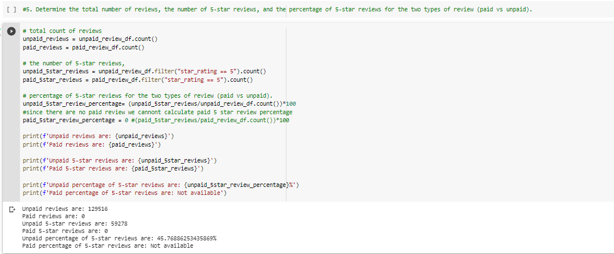
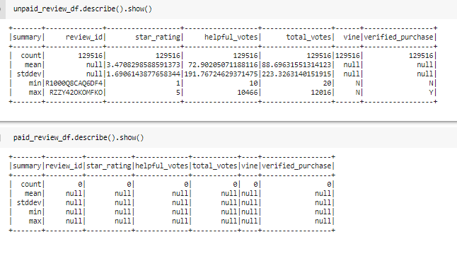

# Amazon_Vine_Analysis
Challenge 16
## Overview of the analysis: 

The purpose of the analysis is analyze Amazon reviews written by members of the paid Amazon Vine program. The Amazon Vine program is a service that allows manufacturers and publishers to receive reviews for their products. 
In order to get meaningful analysis, the reviews with more than total votes were selected.Additionally, only reviews that have over 50% of helpful votes out of total votes were filtered.
 

## Results:
Below are the results: 

 

 

* All reviews were unpaid reviews (non-vine) only. There are total of 129,516 none-vine reviews.
* There are no paid reviews (vine) found. 
* 59,278 non-vine reviews had 5 star rating. In other words 45.76% of non-vine reviews received 5 star rating. 

 

## SUMMARY 
There is no evidence that for positivity bias for Vine and non-vine program due to lack on vine review data. Simply running describe will show the existence of data for non vine (unpaid program) and lack of data for vine (paid program).
 
   